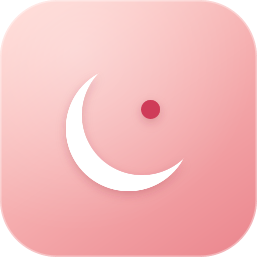
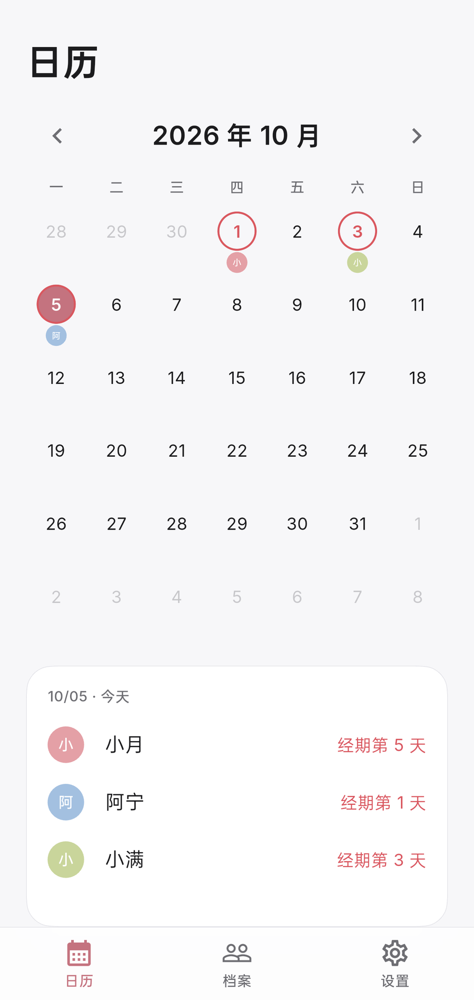
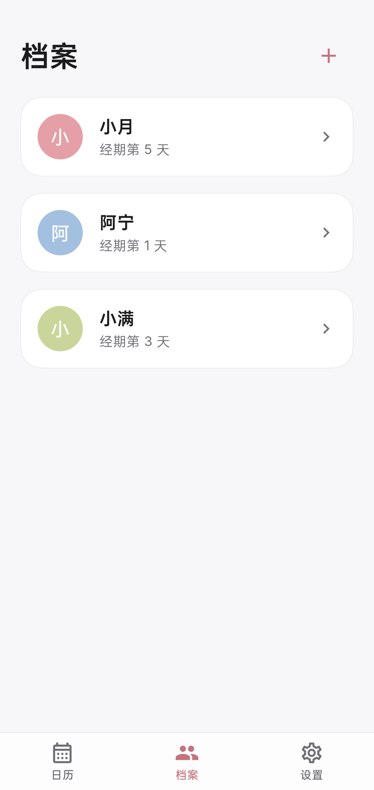
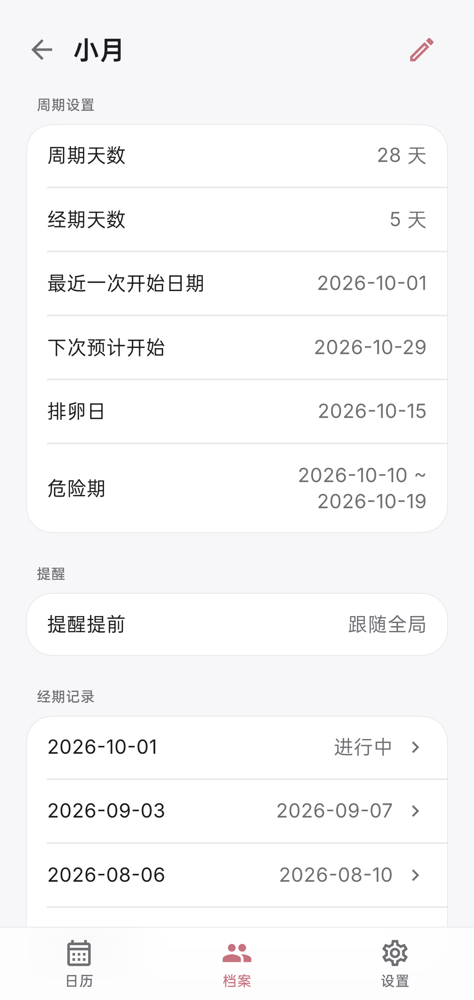
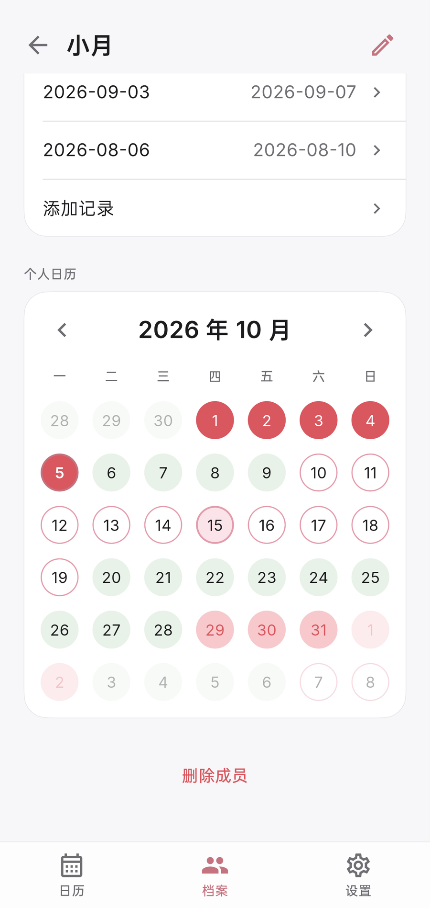
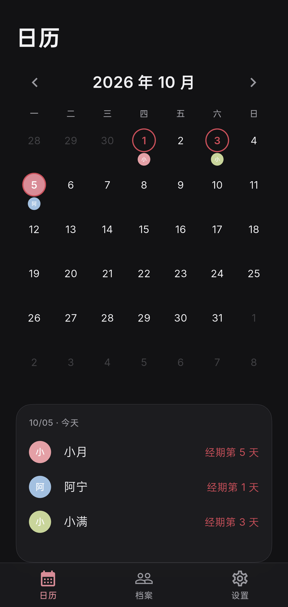
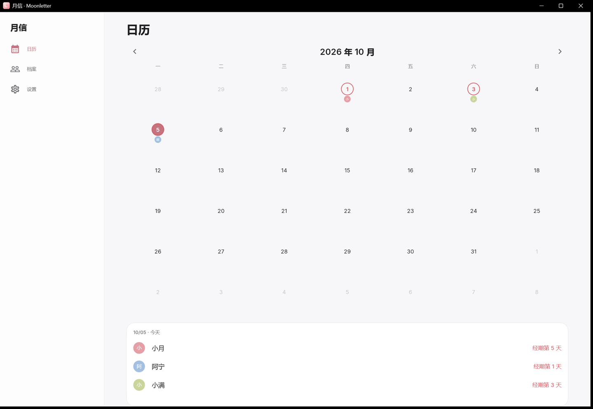
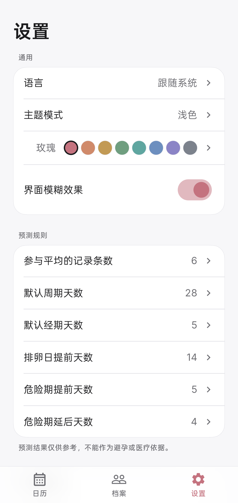

<div align="center">



# 月信 · Moonletter

月有信，日有期。


</div>

月信是一个多人经期记录应用，用 Flutter 开发，支持 Windows 和 Android。数据默认只存在本机，不需要账号，离线可用。需要在多台设备间同步时，可以自行开启端到端加密的同步。

> 预测由历史记录推算，仅供参考，不能作为避孕、诊断或医疗决策的依据。身体有异常请咨询医生。

## 截图

| 日历 | 档案 | 预测与记录 |
| :---: | :---: | :---: |
|  |  |  |

| 个人日历 | 深色模式 |
| :---: | :---: |
|  |  |



Windows 版的底栏变成左侧边栏，窗口较宽时，日历和当天摘要并排显示。

## 功能

### 日历

月历只标记经期开始日，有记录的日子画一圈，当天处于经期的人显示头像，超过三位折叠成 `+N`。点任意一天，下方会列出当天有谁、处于经期第几天。今天和选中的日期用不同的圈区分。

### 档案

每个人单独建档：头像、昵称、年龄、身高、体重、描述，以及各自的周期天数、经期天数和提醒提前天数。没有头像时，用昵称首字和自动分配的颜色代替。

档案底部是个人日历，显示推算出的经期、排卵日和危险期，用不同样式的圈区分。


### 预测

周期天数和经期天数取最近 6 次记录的平均值（次数可改），记录不足时用档案里设定的值。

- 下次开始日 = 最近一次开始日 + 周期天数
- 排卵日 = 下次开始日前 14 天
- 危险期为排卵日前后若干天，其余为安全期

这些参数都可以在「设置 → 预测规则」中调整。



### 提醒

按每个人预测的下次开始日，提前若干天发送系统通知，个人设置优先于全局设置。锁屏通知可以隐藏人名，只显示「经期将至」。

Windows 版常驻托盘，可以开机启动，关闭主窗口后仍在后台计时。Android 版需要通知和「闹钟和提醒」权限，「提醒设置」页会显示当前状态并给出开启步骤。部分系统还需要关闭电池优化，详见[常见问题](#提醒没有按时到达)。

### 隐私

数据存在本机的 SQLite 文件里。没有账号，没有统计和追踪代码，不申请无关权限。

可以开启应用锁，支持 6 位 PIN，或 Windows Hello / Android 生物识别。应用切到后台时内容会被遮住，任务切换器里看不到日期和人名。

同步是可选功能，数据在本机加密后才会上传，服务端只保存密文。

### 导入导出

- 导出 JSON：完整备份，包含头像和全部记录。
- 导出 CSV：只含经期记录，可以直接用 Excel 打开。
- 导入时按记录合并：文件中比本地新的记录会覆盖本地；本地已删除、文件里仍有的成员会被恢复。

### 同步

同步默认关闭。开启后可以选择 WebDAV（Nextcloud、坚果云等），或自建中转服务。两端按记录合并，以最新修改时间为准。删除会保留标记，不会被旧设备上的数据恢复。

同步口令由你自己设置，只保存在本机。口令丢失后，已上传的数据无法解密。配置方法见[同步服务](#同步服务)。

### 外观

提供 8 款预设主题色，支持浅色和深色模式。界面语言为中文和英文，默认跟随系统。底栏和弹层使用毛玻璃效果，在较旧的设备上会自动降级为纯色。

## 下载

在 [Releases](https://github.com/dianaloveava/moonletter/releases) 下载最新版本：

| 平台 | 文件 | 说明 |
| :--- | :--- | :--- |
| Windows 10 / 11（64 位） | `Moonletter-0.1.0-setup.exe` | 安装包，会创建开始菜单和桌面快捷方式 |
| Android 7.0 及以上 | `app-release.apk` | 直接安装，不需要注册或登录 |

也可以从源码构建，见[构建与打包](#构建与打包)。

## 开始使用

1. 打开「档案」，点右上角 `+` 添加成员，填写昵称和周期天数。
2. 记下最近一次经期的开始日，结束后补上结束日，预测会随之更新。
3. 到「设置 → 提醒设置」允许通知权限，选好提前几天提醒。
4. 换设备或备份时，在「设置 → 数据」导出 JSON，再到新设备导入。

## 常见问题

### 提醒没有按时到达

Android：

- 确认通知和「闹钟和提醒」权限都已允许，可在「设置 → 提醒设置」查看状态。
- 把应用加入电池优化白名单。
- 在系统设置里允许自启动，否则重启后要先打开一次应用，提醒才会恢复。
- ColorOS、MIUI 等系统还会额外限制后台活动。

Windows：提醒需要应用在运行。关闭托盘常驻并退出应用后，不会再提醒。

另外，系统可能为了省电把闹钟推迟几分钟送达。

### 忘记同步口令，或者换了设备

口令只保存在本机，丢失后无法解密已上传的数据，开启同步时请另外记一份。

换设备时，可以「导出 JSON，再在新设备导入」，也可以在新设备上填入同一个远端地址和口令继续同步。

### 会上传我的数据吗

不会。应用只有两类网络请求：你主动开启的同步，以及检查更新（可以关闭）。

### 日历上为什么只有开始日

主日历只显示真实记录。推算出的经期、排卵日和危险期，只画在每个人的档案日历里，和已记录的数据分开。

## 同步服务

### WebDAV

在「设置 → 云同步」里填写地址、用户名、密码和子目录。数据在本机加密后上传。

### 中转服务

使用 Cloudflare Worker + R2，代码在 `server/relay`：

```bash
cd server/relay
npm install
npx wrangler login
npx wrangler r2 bucket create moonletter-sync
npx wrangler deploy
```

部署后，把 Worker 地址和「同步 ID」填进应用。

## 构建与打包

前置条件：

- Flutter 3.47+（stable）
- Windows：Visual Studio 2022+，需要「使用 C++ 的桌面开发」工作负载，以及 C++ ATL（`flutter_secure_storage_windows` 依赖 `atlstr.h`）
- Android：Android SDK（platform 36+）、JDK 17+
- 其余依赖由 `flutter pub get` 拉取。SQLite 原生库由 `package:sqlite3` 的 native assets 提供，首次构建会编译一次

```bash
cd app
flutter pub get
flutter run -d windows      # Windows
flutter run -d <device-id>  # Android
```

图标资源已随仓库提交。修改 `app/assets/icon/*.svg` 之后需要重新生成（需要 Node）：

```bash
cd tools/icon-gen
npm install
node gen.mjs
```

### 打包

Windows（先安装 `winget install JRSoftware.InnoSetup`）：

```bash
cd app && flutter build windows --release
"%LOCALAPPDATA%\Programs\Inno Setup 6\ISCC.exe" ..\packaging\windows\moonletter.iss
# 产物：build/installer/Moonletter-<版本>-setup.exe
```

安装界面用的 `packaging/windows/ChineseSimplified.isl` 已包含在仓库中，Inno Setup 官方安装包不带中文语言文件。

Android：正式签名需要 `app/android/key.properties`，仓库中不包含。没有它时命令仍能构建，但产物使用 debug 证书签名，只能自测，不能发布。

```bash
cd app && flutter build apk --release
# 产物：build/app/outputs/flutter-apk/app-release.apk
```

`key.properties` 的格式：

```properties
storeFile=../keystore.jks
storePassword=…
keyAlias=…
keyPassword=…
```

推送 `v0.1.0` 这样的标签后，`.github/workflows/release.yml` 会构建安装包和 APK，并附到 GitHub Release（Android 签名从仓库 secrets 读取）。

## 目录结构

```
app/                 Flutter 应用（Windows + Android）
server/relay/        中转同步服务（Cloudflare Worker + R2）
tools/icon-gen/      图标栅格化脚本（开发期使用，正常构建不需要）
packaging/windows/   Windows 安装包脚本（Inno Setup 6）
docs/screenshots/    界面截图
```

主要代码在 `app/lib`：`core`（主题、路由、平台能力）、`data`（drift 数据库与仓储）、`domain`（预测、提醒、同步、备份的纯逻辑）、`features`（界面）。

## 贡献

欢迎提交 Issue 和 Pull Request。改动后请先跑通：

```bash
cd app
flutter analyze
flutter test
```

## 许可证

[MIT](LICENSE)
